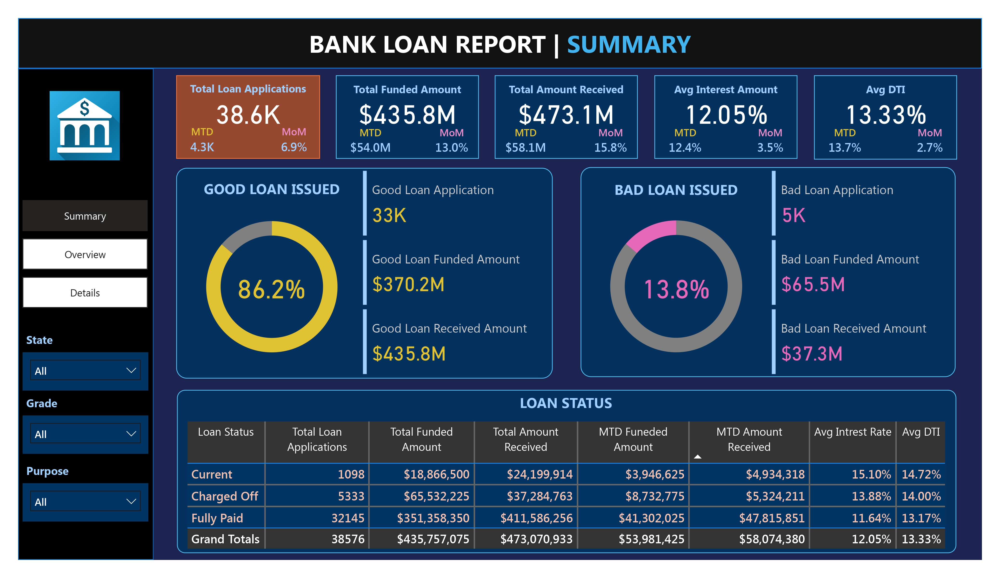
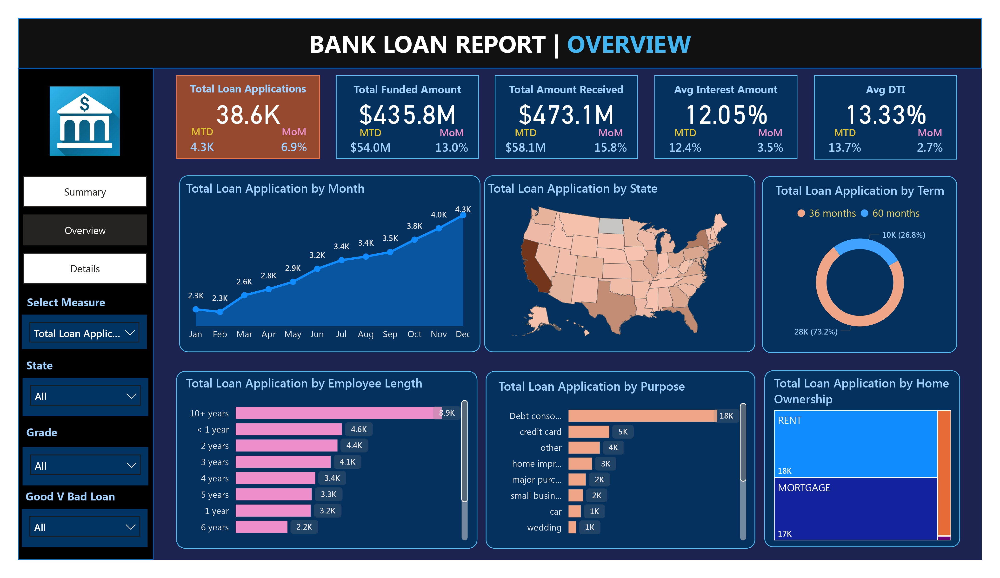
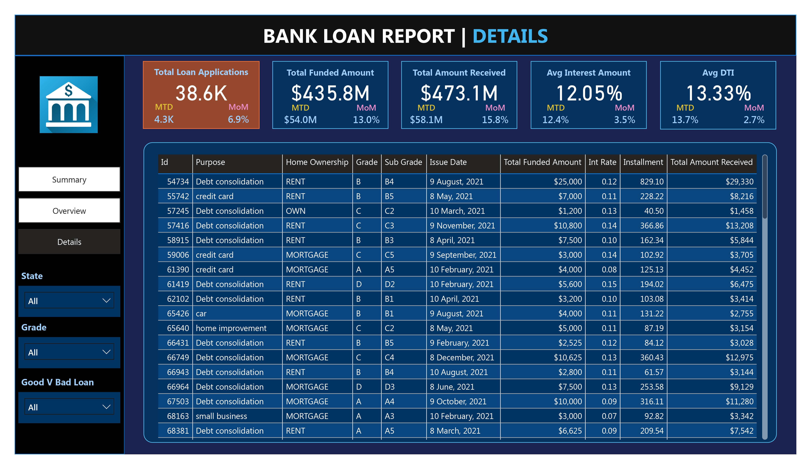

# 🏦 Bank Loan Summary Dashboard | Power BI Project

An interactive Power BI dashboard to analyze **bank loan applications** across key metrics like **loan quality**, **funding trends**, **borrower demographics**, and **repayment performance**.

This dashboard helps **loan officers, data analysts, and risk managers** make informed decisions by uncovering patterns in applications, defaults, and borrower behavior.

---

## 📊 Dashboard Screenshots & Explanations

### 🔹 1. Summary View

#### ✅ Description:
The **Summary tab** provides a high-level overview of total loan metrics, loan status, good vs bad loans, and detailed breakdowns by performance.

#### 📌 Key Metrics:

| Metric                | Value      |
|------------------------|------------|
| Total Applications     | 38.6K      |
| Funded Amount          | $435.8M    |
| Amount Received        | $473.1M    |
| Avg Interest Rate      | 12.05%     |
| Avg DTI                | 13.33%     |

#### 📈 Charts Used:

- **Donut Chart** – Good vs Bad Loan %
- **KPI Cards** – Show main figures like MTD, MoM
- **Matrix Table** – Shows loan performance by status

#### 💡 Why These Charts?

- **Donut Chart**: Easily compares the ratio between good and bad loans.
- **KPI Cards**: Instantly communicates crucial metrics.
- **Matrix Table**: Allows comparison of funded and received amounts per loan status.

---

### 🔹 2. Overview View

#### ✅ Description:
This tab breaks down **loan applications** by time, geography, purpose, and demographics.

#### 📈 Charts Used & Why:

| Chart Title                            | Chart Type          | Why Used                                                  |
|----------------------------------------|----------------------|------------------------------------------------------------|
| Loan Applications by Month             | Line Chart           | Shows seasonality and growth trend month-by-month.        |
| Loan Applications by State             | Filled Map           | Helps identify loan distribution across regions.           |
| Loan Term (36 vs 60 months)            | Donut Chart          | Displays customer preference for repayment period.         |
| Loan Applications by Employee Length   | Bar Chart (Horizontal) | Reflects borrower job stability and trends.             |
| Purpose of Loan                        | Bar Chart            | Understands why customers are applying for loans.          |
| Home Ownership                         | Tree Map             | Visualizes ownership types and their application volume.   |

#### 📌 Insights:

- 📈 Loan demand rises steadily from Jan to Dec.
- 📍 States like CA and TX lead in applications.
- ⏳ 73% of borrowers prefer 36-month terms.
- 🧑‍💼 10+ year employees form the largest group.
- 🧾 Debt consolidation is the top loan purpose.
- 🏠 Slightly more renters apply than mortgage holders.

---

### 🔹 3. Details View

#### ✅ Description:
This tab shows **row-level details** of individual loan records, with purpose, grade, ownership, issue date, funded amount, interest rate, and more.

#### 📈 Chart Used:

- **Table/Matrix Visual** – Ideal for deep inspection of granular data.

#### 💡 Why This Table?

- Enables filtering and slicing for audits.
- Gives full transparency over each loan case.

---

## 🔍 Storytelling Insight

### 🧩 Observations

1. **Loan Volume Rises** 📈  
   > Applications grew consistently — indicating rising demand or improved accessibility.

2. **High Good Loan Ratio** ✅  
   > 86.2% of loans are considered "good", showing strong credit-check or underwriting practices.

3. **Debt Consolidation Dominates** 💸  
   > Majority of loans are for paying off other debts, reflecting financial stress or restructuring needs.

4. **Shorter Terms Preferred** ⏳  
   > Customers prefer shorter 36-month tenures, likely to reduce total interest paid.

5. **10+ Year Employees Lead** 👔  
   > People with long job tenure are more likely to apply, indicating a risk-aware applicant pool.

6. **Geographic Concentration** 🗺  
   > Certain states have significantly higher loan volumes — useful for targeted marketing or policy changes.

---

## 🎯 Recommendations

- Improve **recovery strategies** for 13.8% bad loans.
- Run **location-based offers** in underrepresented states.
- **Promote 60-month loans** with lower interest or EMI to increase adoption.
- Use **employment data** to refine credit risk models.
- Expand services for **debt consolidation** — current demand shows strong potential.

---

## 🗂 Project Structure

| File                          | Description                                 |
|-------------------------------|---------------------------------------------|
| `Summary.jpg`                 | High-level loan KPIs & status               |
| `Overview.jpg`                | Trends, loan term, geography & demographics |
| `Details.jpg`                 | Transaction-level data breakdown            |
| `Loan Summary Dashboard.pbix` | Power BI file for full interactivity        |
| `README.md`                   | Project explanation and insights            |

---

## 🛠 Tools & Technologies Used

- 💻 **Power BI Desktop** – Dashboarding & modeling  
- 📄 **Excel** – Data cleaning and prep  
- 📊 **DAX** – Custom measures for KPIs  
- 🎨 **Visuals** – KPI Cards, Donut, Bar, TreeMap, Maps, Matrix

---

## 📬 Contact

For feedback, questions, or collaboration:

- 📧 **Email:** dwivediaditya2322006@gmail.com  
- 🔗 **LinkedIn:** [Aditya Kumar Dwivedi](https://www.linkedin.com/in/aditya-kumar-dwivedi-3702552aa)

---

## ✨ Final Note

This project demonstrates how data storytelling and financial KPIs can work together to **detect risk**, **improve customer targeting**, and **enhance business decisions** in the lending industry.

> 🔁 Fork it, ⭐ star it, or download and explore the `.pbix` to learn more!
